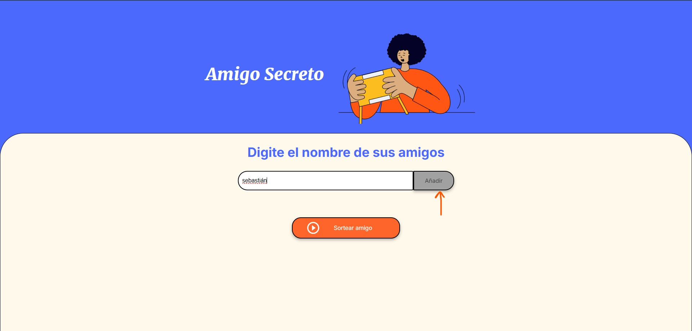
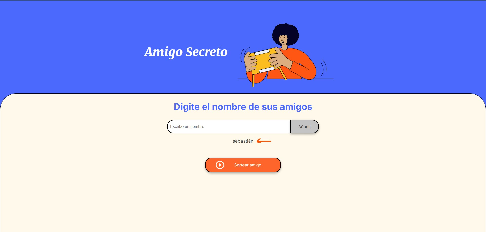
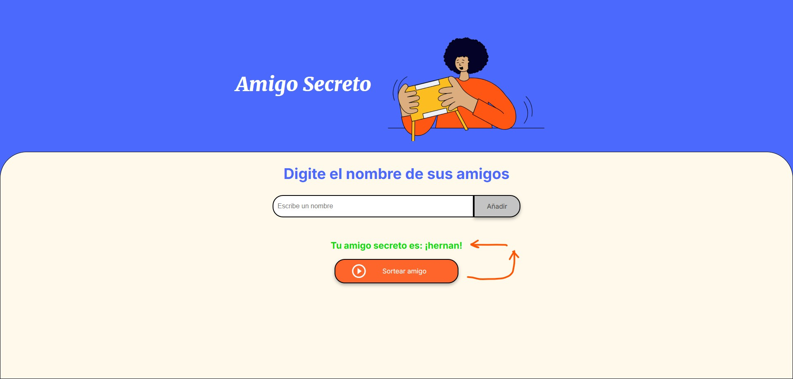

---

#Amigo Secreto 🎁

---

Este es un sencillo proyecto web que permite realizar un sorteo de "Amigo Secreto" de manera rápida y fácil. Los usuarios pueden agregar nombres a una lista y luego sortear aleatoriamente un amigo secreto.

---

###🚀 Características

1. Agregar nombres de participantes.

2. Listar los nombres ingresados.

3. Realizar un sorteo aleatorio.

4. Mostrar el resultado del sorteo.

---

###📂 Estructura del Proyecto

#####📁 challenge-amigo-secreto_esp-main/challenge-amigo-secreto_esp-main/ 
│── assets/ (Imágenes y otros recursos) 
│── app.js (Lógica del sorteo y manipulación del DOM) 
│── index.html (Estructura principal del sitio) 
── style.css (Estilos del sitio)

---

###🛠 Tecnologías Utilizadas

-HTML5

-CSS3

-JavaScript

---

###📝 Uso

-Clona este repositorio en tu máquina local:

`git clone https://github.com/Sebas-Henao/challenge-secret-friend.git`

-Abre el archivo index.html en tu navegador utilizando la extensión de live server.

-Agrega los nombres de los participantes escribiendo en el campo de texto y presionando el botón añadir.

-Presiona el botón "Sortear amigo" para conocer el resultado.

---

###📷 Capturas de Pantalla

-La aplicación consta de un diseño de front con sus estilos generales, un input tipo texto, un botón para añadir, un espacio para listar a lo amigos y un botón para sortear

-Se escribe el nombre del amigo al cual vamos a poner a participar del sorteo

-Se muestra un listado que se actualiza cada vez que se añade un amigo a la lista de sorteo

-Al oprimir en sortear amigo automáticamente aparecerá de color verde

####Detalles adicionales

-Al intentar añadir un amigo sin nombre o sin contenido aparece la alerta para mencionar que el campo no puede estar vació 

-Al sortear todos los amigos de la lista aparece la alerta para informar que el sorteo terminó 

---

###📜 Licencia

Este proyecto está bajo la licencia MIT. ¡Siéntete libre de usarlo y mejorarlo! 🎉 